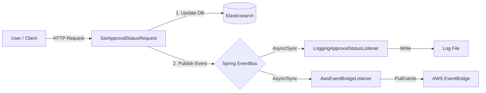

# Event-Driven Architecture for Approval Workflow

## Overview

This document outlines the architectural design and implementation details for the extensible event generation system within the Geoportal Server. The primary goal of this enhancement is to decouple the core approval logic from side effects (such as logging or external notifications) and to provide a seamless integration with AWS EventBridge for downstream processing.

## Architecture

The system utilizes the Spring Framework's `ApplicationEventPublisher` to implement an internal event bus. This allows the core request handler to publish events without knowledge of who receives them.

### Data Flow



## Design Considerations

### 1. Decoupling
By introducing the `ApprovalStatusChangedEvent`, we separate the *action* (changing the status) from the *reaction* (notifying external systems). This adheres to the Open/Closed Principle; new listeners can be added without modifying the existing `SetApprovalStatusRequest` code.

### 2. Fault Tolerance & Stability
*   **Isolation**: Listeners are designed to handle their own exceptions. A failure in the `AwsEventBridgeListener` (e.g., network timeout) logs an error but does **not** fail the original HTTP request or rollback the database change.
*   **Safe JSON Construction**: The AWS listener uses `javax.json` to construct payloads, ensuring valid JSON formatting and proper escaping of user inputs.

### 3. AWS Integration Strategy
*   **SDK Version**: The implementation uses the AWS SDK for Java 2.x (`software.amazon.awssdk`), aligning with modern standards.
*   **Lifecycle Management**: The `EventBridgeClient` is heavy-weight. It is initialized once during the `@PostConstruct` phase and closed during `@PreDestroy` to prevent resource leaks.
*   **Credentials**: The system uses the `DefaultCredentialsProvider`, allowing authentication via environment variables, system properties, or EC2/Container instance profiles transparently.

### 4. Configuration
Configuration is injected via Spring's `property-placeholder` mechanism, supporting Environment Variable overrides. This allows the feature to be enabled/disabled and configured across different environments (Dev, Test, Prod) without rebuilding the WAR file.

## Component Details

### `GeoportalEvent`
A base class extending `ApplicationEvent`, providing a common type for all future Geoportal-specific events.

### `ApprovalStatusChangedEvent`
The specific event payload containing:
*   **User**: The `AppUser` who performed the action.
*   **Status**: The new status string (e.g., "approved", "reviewed").
*   **IDs**: A list of Item IDs that were modified.

### `AwsEventBridgeListener`
The bridge component responsible for:
1.  Checking if the feature is `enabled`.
2.  Initializing the AWS Client.
3.  Transforming the POJO event into a JSON payload.
4.  Dispatching the `PutEventsRequest` to the configured Event Bus.

**JSON Payload Schema:**
```json
{
  "action": "SetApprovalStatus",
  "status": "approved",
  "userId": "admin_user",
  "ids": ["item-uuid-1", "item-uuid-2"]
}
```

## Configuration Guide

The following environment variables control the behavior of the event listeners:

| Environment Variable | Default | Description |
|----------------------|---------|-------------|
| `GPT_EVENTBRIDGEENABLED` | `false` | Master switch to enable the AWS integration. |
| `GPT_EVENTBUSNAME` | *(empty)* | The name or ARN of the target EventBridge Bus. |
| `GPT_AWSREGION` | `us-east-1` | The AWS region where the Event Bus resides. |

## Future Extensibility

To add a new integration (e.g., sending an email or Webhook):
1.  Create a new class implementing `ApplicationListener<ApprovalStatusChangedEvent>`.
2.  Implement the logic in `onApplicationEvent`.
3.  Register the bean in `app-context.xml`.
