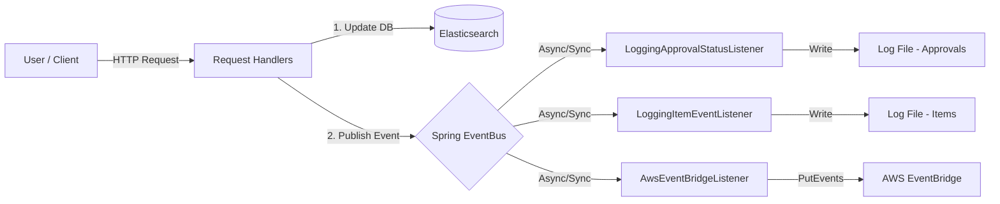

# Event-Driven Architecture for Geoportal

## Overview

This document outlines the architectural design and implementation details for the extensible event generation system within the Geoportal Server. The system publishes events for key data lifecycle operations (create, update, delete) and approval workflow changes, enabling decoupled integration with logging, AWS EventBridge, and other downstream systems.

## Architecture

The system utilizes the Spring Framework's `ApplicationEventPublisher` to implement an internal event bus. This allows the core request handler to publish events without knowledge of who receives them.

### Data Flow



**Request Handlers:**
- `SetApprovalStatusRequest` - publishes `ApprovalStatusChangedEvent`
- `PublishMetadataRequest` - publishes `ItemCreatedEvent` or `ItemUpdatedEvent`
- `DeleteItemRequest` - publishes `ItemDeletedEvent`
- `DeleteItemsRequest` - publishes `ItemDeletedEvent`

## Design Considerations

### 1. Decoupling
By introducing the `ApprovalStatusChangedEvent`, we separate the *action* (changing the status) from the *reaction* (notifying external systems). This adheres to the Open/Closed Principle; new listeners can be added without modifying the existing `SetApprovalStatusRequest` code.

### 2. Fault Tolerance & Stability
*   **Isolation**: Listeners are designed to handle their own exceptions. A failure in the `AwsEventBridgeListener` (e.g., network timeout) logs an error but does **not** fail the original HTTP request or rollback the database change.
*   **Safe JSON Construction**: The AWS listener uses `javax.json` to construct payloads, ensuring valid JSON formatting and proper escaping of user inputs.

### 3. AWS Integration Strategy
*   **SDK Version**: The implementation uses the AWS SDK for Java 2.x (`software.amazon.awssdk`), aligning with modern standards.
*   **Lifecycle Management**: The `EventBridgeClient` is heavy-weight. It is initialized once during the `@PostConstruct` phase and closed during `@PreDestroy` to prevent resource leaks.
*   **Credentials**: The system uses the `DefaultCredentialsProvider`, allowing authentication via environment variables, system properties, or EC2/Container instance profiles transparently.

### 4. Configuration
Configuration is injected via Spring's `property-placeholder` mechanism, supporting Environment Variable overrides. This allows the feature to be enabled/disabled and configured across different environments (Dev, Test, Prod) without rebuilding the WAR file.

## Component Details

### Event Classes

#### `GeoportalEvent`
A base class extending `ApplicationEvent`, providing a common type for all Geoportal-specific events.

#### `ApprovalStatusChangedEvent`
Event published when approval status changes. Contains:
*   **User**: The `AppUser` who performed the action.
*   **Status**: The new status string (e.g., "approved", "reviewed").
*   **IDs**: A list of Item IDs that were modified.

#### `ItemCreatedEvent`
Event published when a new item is created. Contains:
*   **User**: The `AppUser` who created the item.
*   **ItemId**: The ID of the created item.
*   **Title**: The title of the item (may be null).

#### `ItemUpdatedEvent`
Event published when an existing item is updated. Contains:
*   **User**: The `AppUser` who updated the item.
*   **ItemId**: The ID of the updated item.
*   **Title**: The title of the item (may be null).

#### `ItemDeletedEvent`
Event published when one or more items are deleted. Contains:
*   **User**: The `AppUser` who deleted the item(s).
*   **ItemIds**: A list of deleted item IDs.

### Event Listeners

#### `LoggingApprovalStatusListener`
Logs approval status change events to the application log.

#### `LoggingItemEventListener`
Logs item lifecycle events (create, update, delete) to the application log.

#### `AwsEventBridgeListener`
The bridge component responsible for:
1.  Checking if the feature is `enabled`.
2.  Initializing the AWS Client.
3.  Transforming Geoportal events into JSON payloads.
4.  Dispatching the `PutEventsRequest` to the configured Event Bus.

**JSON Payload Schemas:**

*ApprovalStatusChanged:*
```json
{
  "action": "SetApprovalStatus",
  "status": "approved",
  "userId": "admin_user",
  "ids": ["item-uuid-1", "item-uuid-2"]
}
```

*ItemCreated / ItemUpdated:*
```json
{
  "action": "create",
  "itemId": "item-uuid-1",
  "userId": "admin_user",
  "title": "My Dataset"
}
```

*ItemDeleted:*
```json
{
  "action": "delete",
  "userId": "admin_user",
  "itemIds": ["item-uuid-1", "item-uuid-2"]
}
```

**EventBridge Detail Types:**
- `ApprovalStatusChanged`
- `ItemCreated`
- `ItemUpdated`
- `ItemDeleted`

## Configuration Guide

The following environment variables control the behavior of the event listeners:

| Environment Variable | Default | Description |
|----------------------|---------|-------------|
| `GPT_EVENTBRIDGEENABLED` | `false` | Master switch to enable the AWS integration. |
| `GPT_EVENTBUSNAME` | *(empty)* | The name or ARN of the target EventBridge Bus. |
| `GPT_AWSREGION` | `us-east-1` | The AWS region where the Event Bus resides. |

## Future Extensibility

### Adding New Event Types

To add a new event type (e.g., `ItemAccessChangedEvent`):
1.  Create a new event class extending `GeoportalEvent`.
2.  Modify the appropriate request handler to publish the event after successful operations.
3.  Update `AwsEventBridgeListener` to handle the new event type (add to `onApplicationEvent`).
4.  Optionally create dedicated logging listeners for the new event type.

### Adding New Integrations

To add a new integration (e.g., sending an email or Webhook):
1.  Create a new class implementing `ApplicationListener<GeoportalEvent>` (or a specific event type).
2.  Implement the logic in `onApplicationEvent`.
3.  Register the bean in `app-context.xml`.
